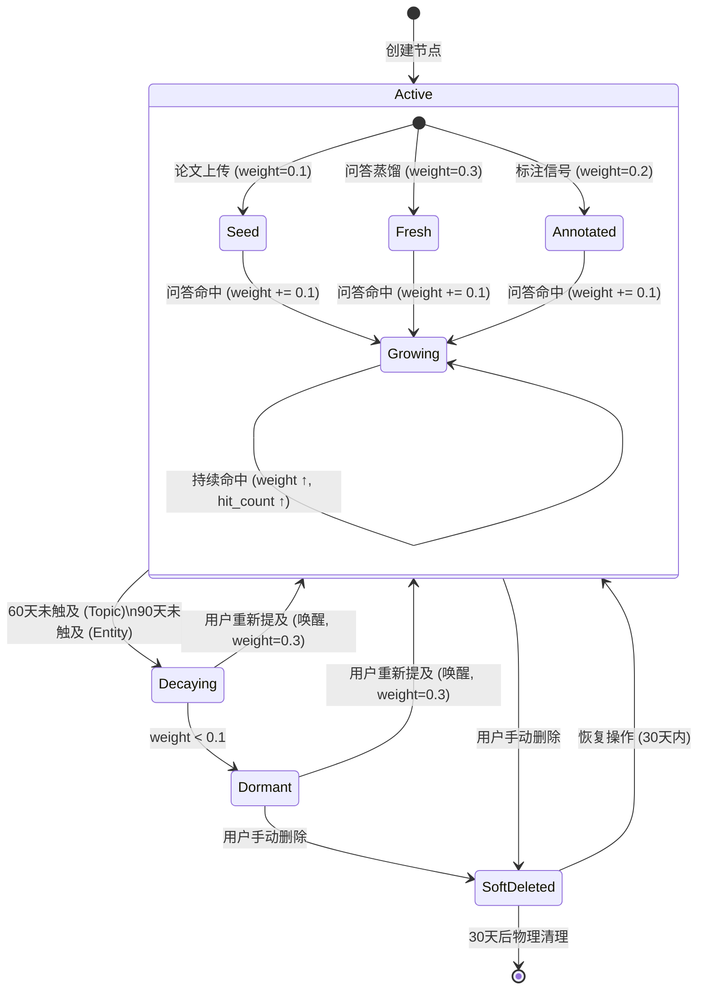

# 用户研究兴趣图谱 — 完整设计文档

> PaperMind 用户兴趣图谱：一张以用户研究为中心、随交互自动生长的领域知识地图。

---

## 一、背景与动机

现有"自生长记忆库"的核心问题：
- 记忆层是**扁平的知识条目列表**，条目之间没有结构关系
- 画像层是**LLM 生成的 200 字纯文本**，不可结构化查询、不可增量更新
- 知识树层只是在**论文图谱节点上打标**，不会因问答行为产生新节点

这些设计无法精准刻画用户的研究方向——"FedAvg"出现 15 次 ≠ 系统真正理解"用户在深入研究联邦学习的通信效率优化，并在对比 FedAvg 和 SCAFFOLD 的方案"。

**目标**：构建一张结构化、可生长、有层级和语义关系的**用户研究兴趣图谱**，随着用户持续使用系统，对其研究方向的刻画越来越精准。

**核心价值**：
- 对系统：精准理解用户方向 → 个性化问答、智能推荐
- 对用户：看到自己研究方向的结构化全景、概念间的关系网络、潜在盲区

---

## 二、与论文图谱的区别

| 维度 | 论文图谱 (Knowledge Graph) | 用户兴趣图谱 (User Interest Graph) |
|---|---|---|
| 描述对象 | 论文的内容（客观事实） | 用户的认知结构（主观关注） |
| 主视角 | "论文 X 提出了方法 Y" | "用户在深入研究方向 Z" |
| 变化频率 | 写入后不变 | 每次交互都可能变 |
| 有无权重 | 无 | 有（weight / hit_count） |
| 有无遗忘 | 无 | 有（分层衰减） |
| 关系来源 | 论文作者声称的 | 用户行为暗示的 |
| 数据来源 | 论文文本（上传时一次提取） | 问答 + 论文上传 + 标注（持续积累） |
| 存储标签 | Paper / Method / Problem / Concept / Dataset | **UserTopic**（独立标签） |

两张图存在同一个 Neo4j 实例中，可通过 `DERIVED_FROM` 边连接。

---

## 三、数据模型

### 3.1 节点

标签：`UserTopic`，所有节点带 `user_id` 实现多用户隔离。

```cypher
(:UserTopic {
    name: "SCAFFOLD",                    -- 实体名称（唯一标识）
    type: "Field" | "Topic" | "Entity",  -- 层级类型
    description: "引入 control variate 校正客户端梯度方向，解决漂移问题",
    user_id: "uuid",

    -- 内部属性（驱动排序/遗忘/注入，不对用户暴露具体数值）
    weight: 0.85,          -- 关注强度 [0, 1.0]
    hit_count: 8,          -- 累计命中次数
    first_seen: datetime,  -- 首次出现时间
    last_seen: datetime,   -- 最近一次触及时间
    status: "active"       -- "active" | "dormant"
})
```

**类型定义**：

| type | 含义 | 例子 | 说明 |
|---|---|---|---|
| `Field` | 大研究方向 | 联邦学习、自然语言处理 | 通常由结构审视阶段归纳产生 |
| `Topic` | 子方向/子问题 | 通信效率优化、数据异质性 | 中间层级 |
| `Entity` | 具体方法/技术/概念 | FedAvg、Control Variate、CIFAR-10 | 最细粒度 |

### 3.2 边

```cypher
(:UserTopic)-[r:CONTAINS|RELATES_TO|COMPARES_WITH]->(:UserTopic)
```

| 关系类型 | 含义 | description 是否必需 | 例子 |
|---|---|---|---|
| `CONTAINS` | 层级包含 | 否（语义明确） | 联邦学习 → 通信效率优化 |
| `RELATES_TO` | 语义关联 | **是**（描述具体什么关系） | SCAFFOLD → 客户端漂移 (desc: "通过 control variate 解决") |
| `COMPARES_WITH` | 对比关系 | 可选 | FedAvg ↔ SCAFFOLD |

边属性：

| 属性 | 类型 | 说明 |
|---|---|---|
| description | str | 关系的具体含义（RELATES_TO 必填） |
| weight | float | 关系强度 [0, 1.0] |
| created_at | str | 创建时间 |
| last_seen | str | 最近触及时间 |

### 3.3 Neo4j 约束

```cypher
CREATE CONSTRAINT IF NOT EXISTS FOR (t:UserTopic) REQUIRE (t.name, t.user_id) IS NODE KEY
```

---

## 四、生长机制

### 4.1 信号源总览

| 信号源 | 触发时机 | 处理方式 | 同步/异步 |
|---|---|---|---|
| 问答 | 每次有效问答后 | LLM 蒸馏提取实体+关系 → 增量写入 | **异步** fire-and-forget |
| 论文上传 | 上传成功时 | 从论文图谱复制实体为种子节点 | **异步** |
| 标注/高亮 | 用户标注段落时 | 轻量术语提取 → 增强节点 weight | **异步** |
| 结构审视 | 每 20 次蒸馏后 | LLM 审视图谱完整性 → 补充层级关系 | **异步** |

### 4.2 问答蒸馏（主要生长路径）

#### 前置过滤（零成本）

```python
def should_distill(question: str, answer: str) -> bool:
    q = question.strip()
    if len(q) < 10: return False
    if "知识库为空" in answer or "未找到相关内容" in answer: return False
    if any(q.startswith(p) for p in ["列出","删除","上传","下载"]) and len(q) < 20: return False
    if q in ["好的","谢谢","明白","了解","ok","OK","嗯","行"]: return False
    return True
```

#### 蒸馏 Prompt

```
请分析以下学术问答，提取用户研究兴趣的结构化信息。

规则：
1. 提取 2-5 个核心实体，标注类型（Field / Topic / Entity）
2. 为每个实体提供一句话描述（说明它是什么，而非用户对它了解多少）
3. 标注实体间关系，类型：CONTAINS / RELATES_TO / COMPARES_WITH
4. 为 RELATES_TO 类型的关系提供一句描述（说明具体什么关系）
5. 不要提取过于泛化的词（"机器学习"、"深度学习"），除非确实是用户焦点
6. 如果指的是下方已有节点中的某个实体，请使用完全一致的名称
7. 如果问答不涉及学术研究，输出 {"skip": true}
8. 只输出 JSON

输出格式：
{
  "entities": [
    {"name": "SCAFFOLD", "type": "Entity", "description": "引入 control variate 校正客户端更新方向的联邦学习算法"}
  ],
  "relations": [
    {"from": "SCAFFOLD", "to": "客户端漂移", "type": "RELATES_TO", "description": "通过控制变量校正来解决漂移问题"}
  ],
  "skip": false
}

--- 用户图谱现有核心节点（请尽量对齐已有名称）---
{existing_nodes_top20}

--- 交互内容 ---
用户问题：{question}
AI 回答（前800字）：{answer_truncated}
来源论文：{source_titles}
```

**existing_nodes_top20 的获取方式**：取该用户 weight 最高的 20 个活跃节点的 name 列表（一次 Cypher 查询，无 LLM）。

#### 写入逻辑

```python
async def write_to_graph(extracted, user_id):
    for entity in extracted["entities"]:
        name = normalize(entity["name"])  # 标准化
        existing = graph.find_node(name, user_id)
        
        if existing:
            # 合并：强化 weight + 更新 last_seen + hit_count++
            graph.update_node(existing.id,
                weight=min(existing.weight + 0.1, 1.0),
                hit_count=existing.hit_count + 1,
                last_seen=now,
            )
            # description 融合：如果新描述更详细则更新
            if len(entity["description"]) > len(existing.description) * 1.2:
                graph.update_description(existing.id, entity["description"])
        else:
            # 创建新节点
            graph.create_node(
                name=name,
                type=entity["type"],
                description=entity["description"],
                user_id=user_id,
                weight=0.3,
                hit_count=1,
                first_seen=now,
                last_seen=now,
                status="active",
            )
    
    for rel in extracted["relations"]:
        from_node = graph.find_node(normalize(rel["from"]), user_id)
        to_node = graph.find_node(normalize(rel["to"]), user_id)
        if not from_node or not to_node:
            continue  # 两端节点不存在则跳过
        
        existing_rel = graph.find_relation(from_node, to_node, rel["type"], user_id)
        if existing_rel:
            graph.update_relation(existing_rel, weight=min(weight+0.1, 1.0), last_seen=now)
        else:
            graph.create_relation(
                from_node, to_node,
                type=rel["type"],
                description=rel.get("description", ""),
                weight=0.3,
                created_at=now,
                last_seen=now,
            )
```

#### Weight 数值规则

| 场景 | weight 变化 |
|---|---|
| 新节点创建（问答蒸馏） | 初始 0.3 |
| 新节点创建（论文种子） | 初始 0.1 |
| 新节点创建（标注信号） | 初始 0.2 |
| 问答命中已有节点 | += 0.1（上限 1.0） |
| 标注命中已有节点 | += 0.05（上限 1.0） |
| 衰减（Topic 超 60 天未触及） | *= 0.95/天 |
| dormant 节点被唤醒 | 恢复到 0.3 |


### 4.3 论文上传种子

论文上传成功后，从论文图谱中提取的实体低权重写入用户兴趣图谱：

```python
async def seed_from_paper_graph(paper_graph_data, user_id):
    """论文上传后，把论文图谱实体作为种子写入用户兴趣图谱"""
    entities = []
    for method in paper_graph_data.get("methods", []):
        entities.append({"name": method["name"], "type": "Entity", "description": method.get("description", "")})
    for problem in paper_graph_data.get("problems", []):
        entities.append({"name": problem["name"], "type": "Entity", "description": problem.get("description", "")})
    for concept in paper_graph_data.get("concepts", []):
        entities.append({"name": concept, "type": "Entity", "description": ""})
    
    for entity in entities:
        name = normalize(entity["name"])
        existing = graph.find_node(name, user_id)
        if existing:
            # 已存在 → 轻微强化（用户选择读这篇论文 = 兴趣信号）
            graph.update_node(existing.id, weight=min(existing.weight + 0.05, 1.0), last_seen=now)
        else:
            graph.create_node(
                name=name,
                type=entity["type"],
                description=entity["description"],
                user_id=user_id,
                weight=0.1,  # 低权重种子
                hit_count=0,
                first_seen=now,
                last_seen=now,
                status="active",
            )
```

### 4.4 标注信号

用户在 PDF 中标注/高亮段落时触发：

```python
async def process_annotation_signal(text: str, paper_title: str, user_id: str):
    """从标注文本中提取关键术语，增强对应图谱节点"""
    # 方式 1：用已有节点名做字符串匹配（零成本）
    active_nodes = graph.get_all_active_nodes(user_id)
    for node in active_nodes:
        if node.name.lower() in text.lower():
            graph.update_node(node.id, weight=min(node.weight + 0.05, 1.0), last_seen=now)
    
    # 方式 2：LLM 轻量提取新术语（可选，低优先级）
    # new_terms = await extract_terms_from_annotation(text)
    # for term in new_terms:
    #     if not graph.find_node(term, user_id):
    #         graph.create_node(name=term, type="Entity", weight=0.2, ...)
```

### 4.5 定期结构审视

**触发条件**：每累积 20 次成功蒸馏写入后，自动触发一次。

**目的**：
- 发现并合并同义/重复节点
- 补充遗漏的 CONTAINS 层级关系
- 为孤立节点建立连接
- 归纳 Field 节点（如果多个 Topic/Entity 属于同一个大方向但还没有对应的 Field）

**Prompt**：

```
你是学术知识图谱结构化专家。请审视以下用户研究兴趣图谱，检查结构完整性。

当前图谱节点：
{nodes_dump}  (格式: name | type | hit_count)

当前图谱关系：
{relations_dump}  (格式: from -> type -> to)

请检查并输出需要执行的操作：
1. merge: 应该合并的同义节点对（输出 [keep_name, remove_name]）
2. add_contains: 应该补充的层级关系（哪些 Entity 应归属到哪个 Topic/Field 下）
3. add_field: 应该新建的 Field 节点（如果多个 Topic 明显属于同一大方向）
4. add_relation: 应该补充的语义关系

只输出 JSON：
{
  "merge": [{"keep": "FedAvg", "remove": "Federated Averaging"}],
  "add_contains": [{"parent": "联邦学习", "child": "FedAvg"}],
  "add_field": [{"name": "联邦学习", "description": "..."}],
  "add_relation": [{"from": "...", "to": "...", "type": "RELATES_TO", "description": "..."}]
}
```

**Token 控制**：只传 name + type + hit_count（不传 description 全文），控制在 2000 token 以内。超过 100 节点时只传 weight > 0.2 的活跃节点。

---

## 五、遗忘机制

### 5.1 执行时机

每次蒸馏写入成功后，顺带执行一次轻量衰减检查（单条 Cypher，不遍历全表）。

### 5.2 分层策略

| 节点 type | 衰减规则 | 理由 |
|---|---|---|
| `Field` | **不衰减** | 大方向是用户知识背景，不会消失 |
| `Topic` | 60 天不触及 → weight *= 0.95/天 | 子方向可能阶段性放下 |
| `Entity` | 90 天不触及 + weight < 0.1 → status = "dormant" | 具体概念不再关注则退场 |

### 5.3 Cypher 实现

```cypher
-- Topic 衰减（每次蒸馏后执行）
MATCH (t:UserTopic {user_id: $user_id, type: "Topic", status: "active"})
WHERE t.last_seen < datetime() - duration('P60D')
SET t.weight = t.weight * power(0.95, duration.inDays(datetime(), t.last_seen) - 60)

-- Entity 休眠
MATCH (t:UserTopic {user_id: $user_id, type: "Entity", status: "active"})
WHERE t.last_seen < datetime() - duration('P90D') AND t.weight < 0.1
SET t.status = "dormant"
```

### 5.4 唤醒

用户重新问到某个 dormant 节点时（蒸馏提取的实体匹配到 dormant 节点）：

```python
if existing and existing.status == "dormant":
    graph.update_node(existing.id, status="active", weight=0.3, last_seen=now, hit_count=existing.hit_count+1)
```

---

## 六、实体消歧

### 6.1 三层防线

| 层级 | 方式 | 时机 | 成本 |
|---|---|---|---|
| Prompt 引导 | 蒸馏时注入现有 Top-20 节点名，要求 LLM 使用一致名称 | 每次蒸馏 | 零（已在 prompt 中） |
| 写入前标准化 | 统一英文大小写、去后缀、缩写映射 | 每次写入 | 零 |
| 结构审视合并 | LLM 审视图谱时发现同义节点并合并 | 每 20 次蒸馏 | 1 次 LLM 调用 |

### 6.2 标准化规则

```python
def normalize(name: str) -> str:
    name = name.strip()
    # 1. 常见缩写映射（双向）
    ALIAS_MAP = {
        "FL": "Federated Learning",
        "DP": "Differential Privacy",
        "SGD": "Stochastic Gradient Descent",
        # ... 初始手写，结构审视可补充
    }
    # 如果是已知缩写的展开形式，统一为缩写
    for abbr, full in ALIAS_MAP.items():
        if name.lower() == full.lower():
            return abbr
    
    # 2. 去多余后缀
    for suffix in ["算法", "方法", "技术", "模型", "framework", "algorithm", "method"]:
        if name.lower().endswith(suffix.lower()) and len(name) > len(suffix) + 2:
            name = name[:-(len(suffix))].strip()
    
    # 3. 保持原始大小写（学术术语大小写有含义，如 FedAvg ≠ fedavg）
    return name
```

### 6.3 合并操作

当结构审视判定两个节点为同义时：

```python
def merge_nodes(keep_id, remove_id, user_id):
    keep = graph.get_node(keep_id)
    remove = graph.get_node(remove_id)
    
    # 1. 属性合并：取较大 weight，合并 description
    merged_weight = max(keep.weight, remove.weight)
    merged_hit = keep.hit_count + remove.hit_count
    merged_desc = keep.description if len(keep.description) >= len(remove.description) else remove.description
    
    graph.update_node(keep_id, weight=merged_weight, hit_count=merged_hit, description=merged_desc)
    
    # 2. 关系迁移：把 remove 的所有关系转移到 keep 上
    graph.transfer_relations(from_node=remove_id, to_node=keep_id)
    
    # 3. 删除 remove 节点
    graph.delete_node(remove_id)
```

---

## 七、问答注入

### 7.1 检索相关节点

从用户兴趣图谱中找到与当前问题相关的节点（同步，无 LLM）：

```python
def search_interest_nodes(question: str, user_id: str, limit: int = 10) -> list:
    """用问题关键词在图谱中做模糊匹配"""
    # 提取问题中的关键词（简单分词，或用已有的 query rewrite 结果）
    keywords = extract_keywords(question)
    
    # Neo4j 模糊匹配：节点 name 包含任一关键词
    nodes = graph.search_by_keywords(keywords, user_id, status="active", limit=limit)
    
    # 按 weight 排序取 Top
    return sorted(nodes, key=lambda n: n.weight, reverse=True)[:limit]
```

### 7.2 序列化为 Prompt 上下文

```python
def build_interest_context(related_nodes, user_id) -> str:
    if not related_nodes:
        return ""
    
    # 找上层 Field（提供方向背景）
    fields = set()
    for node in related_nodes:
        ancestors = graph.get_ancestors(node, user_id, type="Field")
        fields.update(ancestors)
    
    lines = ["**用户研究上下文：**"]
    if fields:
        lines.append("研究方向：" + "、".join(f.name for f in fields))
    
    lines.append("相关已有认知：")
    for node in related_nodes[:5]:
        if node.description:
            lines.append(f"• {node.name}：{node.description}")
        else:
            lines.append(f"• {node.name}")
    
    # 找对比关系
    comparisons = graph.get_comparisons_among(related_nodes, user_id)
    if comparisons:
        lines.append("用户正在关注的对比：")
        for c in comparisons:
            lines.append(f"• {c.from_name} vs {c.to_name}")
    
    lines.append("")
    lines.append("请基于用户已有认知回答，不重复解释已熟悉的基础概念。")
    return "\n".join(lines)
```

### 7.3 与现有记忆注入的共存

| 注入类型 | 来源 | 提供什么 | 保留 |
|---|---|---|---|
| 兴趣图谱上下文 | UserTopic 图 | 方向背景 + 已有认知描述 + 对比关系 | ✓ 新增 |
| 记忆条目 | ChromaDB memories | 具体知识点（"FedAvg 的漂移问题本质是..."） | ✓ 保留 |
| 论文图谱 | Paper/Method/Concept 图 | 客观事实辅助 | ✓ 保留（现有） |

三者在 prompt 中依次注入，互补不重叠。


---

## 八、Description 演进

### 8.1 策略

- **首次创建**：写入蒸馏/论文提取时的 description
- **合并时融合**：当同一节点被多次命中且新的 description 更详细时更新
- **不频繁更新**：只在 `len(new_desc) > len(old_desc) * 1.2` 时才触发更新（避免描述来回波动）

### 8.2 融合规则

```python
def should_update_description(old_desc: str, new_desc: str) -> bool:
    """判断是否应该更新描述"""
    if not old_desc:
        return bool(new_desc)
    if not new_desc:
        return False
    # 新描述明显更长（至少多 20%）
    return len(new_desc) > len(old_desc) * 1.2
```

不做 LLM 融合（成本过高，且容易引入不稳定）。简单保留更详细的版本。

---

## 九、推荐系统集成

```python
def get_recommendation_keywords(user_graph, memory_store=None, user_id="system"):
    """从用户兴趣图谱驱动推荐关键词"""
    
    # 1. 取 weight 最高的 Field
    top_fields = user_graph.get_top_nodes(user_id, type="Field", limit=2)
    
    # 2. 取每个 Field 下"有兴趣但还在探索"的 Topic（weight 中等、hit_count 较低）
    exploring = []
    for field in top_fields:
        children = user_graph.get_children(field, user_id, sort_by="weight")
        for child in children:
            if child.hit_count < 5 and child.weight > 0.2:
                exploring.append(child.name)
    
    # 3. 回退：记忆库 topics 频率
    if not exploring and memory_store:
        return memory_store.get_top_topics(user_id, limit=5)
    
    # 4. 再回退：图谱 Top 节点名
    if not exploring:
        return [f.name for f in top_fields]
    
    return exploring[:5]
```

---

## 十、前端 Memory Base 页面

### 10.1 页面布局

```
┌─────────────────────────────────────────────────────┐
│ Memory Base                                          │
├───────────┬────────────┬────────────────────────────┤
│ 节点总数   │ 研究方向数  │ 最近活跃时间               │
│ (统计卡)   │ (统计卡)   │ (统计卡)                   │
├───────────┴────────────┴────────────────────────────┤
│                                                      │
│   用户研究兴趣图谱（主视觉区域，占页面 50% 高度）       │
│   [可交互的图谱可视化]                                │
│                                                      │
├─────────────────────┬───────────────────────────────┤
│ 研究方向摘要         │ 最近生长记录                   │
│ (从图谱结构遍历生成)  │ (最近的图谱变更事件列表)       │
└─────────────────────┴───────────────────────────────┘
```

### 10.2 图谱可视化规格

| 属性 | 规格 |
|---|---|
| 库 | react-force-graph-2d（轻量、支持交互） |
| 默认展示 | Top-20 高 weight 活跃节点 |
| 节点大小 | 映射 weight（内部值，不暴露数字） |
| 节点颜色 | 按 type 区分：Field=紫色，Topic=蓝色，Entity=绿色 |
| 边粗细 | 映射关系 weight |
| 边颜色 | 按 type 区分：CONTAINS=灰色，RELATES_TO=蓝色，COMPARES_WITH=橙色 |
| 节点标签 | 显示 name |
| 交互 | 点击节点展开详情面板 |
| 视图切换 | 力导向图 ↔ 树状层级图 |
| 筛选 | 按 Field 筛选子图 |
| 显示全部 | 包含 dormant 节点（默认隐藏） |

### 10.3 节点详情面板

点击节点后右侧弹出：

```
┌─────────────────────────┐
│ SCAFFOLD                 │
│ Entity · 联邦学习        │
├─────────────────────────┤
│ 描述：                   │
│ 引入 control variate     │
│ 校正客户端更新方向...     │
├─────────────────────────┤
│ 关联概念：               │
│ • → 客户端漂移 (解决)    │
│ • ↔ FedAvg (对比)       │
│ • ← 联邦学习 (属于)      │
├─────────────────────────┤
│ 来源论文：               │
│ • "SCAFFOLD: ..."        │
├─────────────────────────┤
│ [删除此节点]             │
└─────────────────────────┘
```

### 10.4 研究方向摘要

从图谱结构遍历生成（不调 LLM）：

```
核心方向：联邦学习
├── 通信效率优化
│   ├── FedAvg — 通过本地多轮训练减少通信轮次
│   ├── FedSGD — 每轮同步梯度，通信开销大
│   └── 梯度压缩 — 压缩通信数据量
├── 数据异质性
│   ├── 客户端漂移 — Non-IID 数据导致模型偏离
│   └── SCAFFOLD — control variate 校正更新方向
└── 隐私保护（浅层）
    └── 差分隐私 — 添加噪声保护个体隐私
```

### 10.5 生长记录

记录图谱的每次变更事件，存储在 SQLite：

```sql
CREATE TABLE IF NOT EXISTS interest_graph_log (
    id TEXT PRIMARY KEY,
    user_id TEXT NOT NULL,
    event_type TEXT NOT NULL,  -- "node_created" | "node_strengthened" | "relation_created" | "nodes_merged" | "structure_review"
    detail TEXT NOT NULL,      -- JSON: {"node": "FedAvg", "weight_before": 0.3, "weight_after": 0.4} 等
    source TEXT,               -- "qa_distill" | "paper_upload" | "annotation" | "structure_review"
    created_at TEXT NOT NULL
);
```

前端展示最近 20 条：

```
• 2 小时前 — 新增概念「SCAFFOLD」，来自问答蒸馏
• 2 小时前 — 发现关系：SCAFFOLD → 客户端漂移 (解决)
• 昨天 — 强化概念「FedAvg」(来自论文标注)
• 3 天前 — 结构整理：归纳出研究方向「联邦学习」
```

---

## 十一、后端 API

| 端点 | 方法 | 说明 |
|---|---|---|
| `/api/memory/interest-graph` | GET | 获取用户兴趣图谱（nodes + edges），参数: status=active\|all |
| `/api/memory/interest-graph/node/{node_id}` | GET | 获取节点详情（含关联关系、来源论文） |
| `/api/memory/interest-graph/node/{node_id}` | PATCH | 修改节点属性（name / description / type） |
| `/api/memory/interest-graph/node/{node_id}` | DELETE | 软删除节点（30天内可恢复） |
| `/api/memory/interest-graph/node/{node_id}/restore` | POST | 恢复已软删除的节点 |
| `/api/memory/interest-graph/merge` | POST | 手动合并两个节点 `{keep_id, remove_id}` |
| `/api/memory/interest-graph/rebuild` | POST | 强制触发一次结构审视 |
| `/api/memory/interest-graph/summary` | GET | 研究方向结构化摘要（树状结构） |
| `/api/memory/interest-graph/stats` | GET | 图谱统计（节点数分 type、关系数、最近活跃） |
| `/api/memory/interest-graph/health` | GET | 图谱质量健康度指标 |
| `/api/memory/interest-graph/metrics` | GET | 运行指标（最近 7 天聚合统计） |
| `/api/memory/growth-log` | GET | 最近的生长记录（分页） |
| `/api/memory/status` | GET | 综合状态（图谱节点数 + 记忆条目数 + 画像状态） |
| `/api/memory/items` | GET | 记忆条目列表（保留，作为生长日志补充） |
| `/api/memory/items/{id}` | DELETE | 删除记忆条目 |

---

## 十二、模块结构

```
memory/
├── __init__.py
├── interest_graph.py       # 用户兴趣图谱核心（Neo4j CRUD + 检索 + 衰减）
├── interest_distiller.py   # 蒸馏器（问答后提取实体+关系，写入图谱）
├── interest_retriever.py   # 问答注入（从图谱检索相关节点，序列化为上下文）
├── structure_reviewer.py   # 定期结构审视（LLM 审视图谱完整性）
├── profile_builder.py      # 画像构建（从图谱遍历生成，不再依赖 LLM）
├── memory_store.py         # 保留：记忆条目存储（作为生长日志）
├── memory_retriever.py     # 保留：记忆条目检索注入
├── distiller.py            # 保留：记忆条目蒸馏（与图谱蒸馏并行执行）
└── knowledge_tree.py       # 废弃：由 interest_graph 替代
```

---

## 十三、与现有代码的集成点

| 集成点 | 现有文件 | 改造方式 |
|---|---|---|
| 问答后触发图谱蒸馏 | `rag/qa_chain.py` | fire-and-forget 调用 `interest_distiller.distill_async()` |
| 问答前注入图谱上下文 | `rag/qa_chain.py` | 同步调用 `interest_retriever.build_context()` |
| 论文上传写入种子 | `server.py` upload_paper | 异步调用 `interest_graph.seed_from_paper()` |
| 标注触发信号 | `server.py` create_annotation | 异步调用 `interest_graph.process_annotation()` |
| Neo4j 存储扩展 | `graph/neo4j_store.py` | 新增 UserTopic 相关 Cypher 方法 |
| 推荐关键词 | `recommend/semantic_scholar.py` | 优先从图谱获取关键词 |
| 前端 Memory Base | `frontend/src/app/memory/page.tsx` | 重构：图谱可视化 + 交互 |
| 前端新依赖 | `frontend/package.json` | 添加 react-force-graph |

---

## 十四、同步/异步边界

| 操作 | 时机 | 同步/异步 | LLM 调用 |
|---|---|---|---|
| 图谱上下文注入 prompt | 问答前 | **同步** | ❌（Neo4j 查询） |
| 记忆条目注入 prompt | 问答前 | **同步** | ❌（ChromaDB 查询） |
| 图谱蒸馏（提取实体+关系） | 问答后 | **异步** | ✅（1 次） |
| 记忆条目蒸馏 | 问答后 | **异步** | ✅（1 次，与图谱蒸馏可合并为单次调用） |
| 论文种子写入 | 上传后 | **异步** | ❌ |
| 标注信号处理 | 标注后 | **异步** | ❌ |
| 结构审视 | 每 20 次蒸馏 | **异步** | ✅（1 次） |
| 衰减检查 | 蒸馏后附带 | **异步** | ❌（单条 Cypher） |

**优化：图谱蒸馏与记忆蒸馏合并为单次 LLM 调用**。蒸馏 prompt 同时输出结构化实体+关系和一条知识摘要句：

```json
{
  "entities": [...],
  "relations": [...],
  "knowledge_summary": "FedAvg 通过本地多轮训练减少通信，SCAFFOLD 用 control variate 修正漂移",
  "skip": false
}
```

`knowledge_summary` 写入记忆条目（保留现有 memory_store 功能），`entities` + `relations` 写入图谱。一次调用，两路写入。

---

## 十五、降级方案

| 故障 | 影响范围 | 降级行为 |
|---|---|---|
| Neo4j 不可用 | 整个图谱功能 | 跳过图谱注入/蒸馏，问答照常（记忆条目仍工作） |
| 蒸馏 LLM 调用失败 | 本轮生长 | 跳过，只打日志，不影响问答 |
| 结构审视 LLM 失败 | 本次审视 | 跳过，下次再试 |
| 图谱为空（新用户） | 前端展示 | 显示引导文案 + 记忆条目列表 |

**原则：图谱功能的任何失败都不应让用户感知到。**

---

## 十六、配置项

```env
# 用户兴趣图谱
INTEREST_GRAPH_SEED_WEIGHT=0.1              # 论文种子节点初始 weight
INTEREST_GRAPH_DISTILL_WEIGHT=0.3           # 蒸馏新节点初始 weight
INTEREST_GRAPH_HIT_BOOST=0.1               # 命中已有节点时 weight 增量
INTEREST_GRAPH_DECAY_START_DAYS=60          # Topic 开始衰减的天数
INTEREST_GRAPH_DORMANT_DAYS=90             # Entity 进入 dormant 的天数
INTEREST_GRAPH_DORMANT_WEIGHT_THRESHOLD=0.1 # 低于此 weight 才进入 dormant
INTEREST_GRAPH_REVIEW_INTERVAL=20           # 每 N 次蒸馏触发一次结构审视
INTEREST_GRAPH_TOP_NODES_FOR_PROMPT=20      # 蒸馏时注入现有节点名的数量
INTEREST_GRAPH_MAX_DISPLAY_NODES=20         # 前端默认展示节点数
INTEREST_GRAPH_MAX_ACTIVE_NODES=300         # 活跃节点硬上限，超出自动 dormant
INTEREST_GRAPH_SOFT_DELETE_DAYS=30          # 软删除保留天数
INTEREST_GRAPH_PHYSICAL_CLEANUP_DAYS=180    # dormant 节点超过此天数物理清理
INTEREST_GRAPH_LOW_CONFIDENCE_THRESHOLD=0.3 # 关系低置信度阈值（不参与注入）
INTEREST_GRAPH_DISTILL_RETRY_COUNT=1        # 蒸馏失败重试次数
INTEREST_GRAPH_DISTILL_RETRY_DELAY=2        # 重试间隔（秒）
```

---

## 十七、验收标准

1. **图谱生长验收**：用户上传 3 篇论文 + 问答 10 轮后，图谱中应有 15+ 个活跃节点和 10+ 条关系
2. **结构准确验收**：图谱中的层级关系（CONTAINS）应正确反映研究方向的包含关系
3. **问答增强验收**：注入图谱上下文后，AI 回答应避免重复解释用户已熟悉的概念
4. **遗忘验收**：停止问某个方向 90 天后，相关 Entity 节点应进入 dormant
5. **前端验收**：Memory Base 页面正确展示可交互的图谱可视化 + 方向摘要 + 生长日志
6. **推荐验收**：推荐关键词应从图谱中"有兴趣但还在探索"的方向获取
7. **降级验收**：关闭 Neo4j 时，系统行为等同于没有图谱功能，不报错
8. **性能验收**：图谱注入不增加问答首字延迟（同步路径无 LLM 调用，纯 Neo4j 查询 < 100ms）

---

## 十八、与旧版设计的关系

本文档替代 `docs/self-growing-memory-design.md` 中"知识树层"和"画像层"的设计。以下模块保留不变：

- **记忆条目**（memory_store + distiller + memory_retriever）：继续作为细粒度知识点存储和问答注入使用
- **记忆蒸馏的前置过滤**：规则过滤逻辑不变
- **记忆条目的去重合并**：逻辑不变

以下模块被替代：

- **knowledge_tree.py**：由 `interest_graph.py` 替代
- **profile_builder.py**：重写为从图谱遍历生成（不再 LLM 生成纯文本）
- **画像缓存 (user_profiles 表)**：不再需要，画像是图谱的实时视图

---

## 十九、Graph Lifecycle（节点生命周期）

### 状态流转图



### 完整生命周期流程

```
Paper Upload / QA Distill / Annotation
         │
         ▼
┌─────────────────────────┐
│  CREATE NODE             │
│  status = "active"       │
│  weight = 0.1~0.3       │
│  hit_count = 0~1        │
└────────────┬────────────┘
             │
             ▼  (每次问答/标注命中)
┌─────────────────────────┐
│  UPDATE / STRENGTHEN     │
│  weight += 0.1          │
│  hit_count += 1         │
│  last_seen = now        │
│  Interest Score ↑        │
└────────────┬────────────┘
             │
             │  (Topic: 60天未触及)
             │  (Entity: 90天未触及)
             ▼
┌─────────────────────────┐
│  DECAY                   │
│  weight *= 0.95/天       │
│  (仅 Topic/Entity)      │
└────────────┬────────────┘
             │
             │  (weight < 0.1 且 Entity)
             ▼
┌─────────────────────────┐
│  DORMANT                 │
│  status = "dormant"      │
│  不参与检索/展示         │
│  不参与问答注入          │
└────────────┬────────────┘
             │
     ┌───────┴───────┐
     │               │
     ▼               ▼  (用户重新提及)
┌──────────┐   ┌──────────────────┐
│ 用户删除  │   │  WAKE UP          │
│          │   │  status="active"  │
│          │   │  weight=0.3       │
└────┬─────┘   └──────────────────┘
     │
     ▼
┌─────────────────────────┐
│  SOFT DELETE             │
│  status = "deleted"      │
│  保留 30 天              │
│  可通过 restore 恢复     │
└────────────┬────────────┘
             │
             │  (30天后)
             ▼
┌─────────────────────────┐
│  PHYSICAL DELETE         │
│  从 Neo4j 物理移除       │
│  同时清理所有关系        │
└─────────────────────────┘
```

### 各状态下的行为

| 状态 | 参与检索 | 参与问答注入 | 前端展示 | 可被蒸馏命中 |
|---|---|---|---|---|
| active | ✓ | ✓ | ✓（默认显示） | ✓ |
| dormant | ✗ | ✗ | ✗（"显示全部"时显示） | ✓（命中即唤醒） |
| deleted | ✗ | ✗ | ✗ | ✗ |

---

## 二十、Interest Score（综合兴趣分）

### 设计动机

单一 weight 无法区分不同兴趣模式：
- "最近 3 天问了 5 次"（短期爆发）
- "半年来每周问 1 次"（长期稳定）

两者 weight 可能相近，但含义完全不同。

### 计算公式

不新增存储字段，从现有属性（weight / hit_count / first_seen / last_seen）动态计算：

```python
def compute_interest_score(node) -> float:
    """综合兴趣分，用于排序和注入决策。范围 [0, 1.0]"""
    
    # Recency: 最近触及越近分越高（指数衰减，半衰期 30 天）
    days_since_last = (now - node.last_seen).days
    recency = 0.5 ** (days_since_last / 30)
    
    # Frequency: 命中次数归一化
    frequency = min(node.hit_count / 10, 1.0)
    
    # Duration: 关注持续时间（从首次到最近，越长越稳定）
    duration_days = (node.last_seen - node.first_seen).days
    duration = min(duration_days / 90, 1.0)
    
    # Behavior weight: 累积的行为权重
    behavior = node.weight
    
    # 综合分 = 各因子加权
    score = recency * 0.3 + frequency * 0.3 + duration * 0.2 + behavior * 0.2
    return round(score, 4)
```

### 使用场景

| 场景 | 使用方式 |
|---|---|
| 问答注入时选节点 | 按 interest_score 排序取 Top-5 |
| 前端展示节点大小 | 映射 interest_score |
| 推荐关键词提取 | 取 score 高但 hit_count 低的节点 |
| 衰减后是否 dormant | 仍然用 weight < 0.1 判断（不改） |

---

## 二十一、关系可信度管理

### 边属性扩展

```cypher
(:UserTopic)-[r:RELATES_TO {
    description: "通过 control variate 解决",
    weight: 0.6,
    confidence: 0.7,       -- 置信度 [0, 1.0]
    support_count: 3,      -- 被几次独立来源确认
    source: "qa_distill",  -- 首次来源
    created_at: datetime,
    last_seen: datetime
}]->(:UserTopic)
```

### 置信度规则

| 场景 | confidence 变化 |
|---|---|
| 关系首次创建（LLM 蒸馏） | 初始 0.5 |
| 同一关系被另一次蒸馏再次确认 | += 0.15（上限 1.0），support_count += 1 |
| 论文图谱中存在对应关系 | += 0.2（来自客观事实） |
| 结构审视确认 | += 0.1 |

### 使用策略

| confidence 范围 | 行为 |
|---|---|
| ≥ 0.5 | 正常参与问答注入和展示 |
| 0.3 ~ 0.5 | 展示时用虚线标记，注入时不包含 |
| < 0.3 | 不展示、不注入，等待后续确认或清理 |

---

## 二十二、Description 更新策略改进

### 更新条件

```python
def should_update_description(old_desc: str, new_desc: str) -> bool:
    """改进版：长度 + 关键词校验"""
    if not old_desc:
        return bool(new_desc)
    if not new_desc:
        return False
    
    # 条件 1：新描述明显更长（至少多 20%）
    if len(new_desc) <= len(old_desc) * 1.2:
        return False
    
    # 条件 2：新描述包含旧描述的核心关键词（避免跑偏）
    old_keywords = set(extract_keywords(old_desc))
    new_keywords = set(extract_keywords(new_desc))
    overlap = old_keywords & new_keywords
    if old_keywords and len(overlap) / len(old_keywords) < 0.3:
        return False  # 新描述与旧描述几乎无关，拒绝更新
    
    return True
```

### prev_description 保留

节点增加 `prev_description` 属性（单层，不做完整版本历史）：

```cypher
SET t.prev_description = t.description,
    t.description = $new_description
```

前端节点详情面板中可选"查看上一版本描述"。

---

## 二十三、容量治理

### 活跃节点上限

```env
INTEREST_GRAPH_MAX_ACTIVE_NODES=300
```

### 超限处理

每次蒸馏写入后检查：

```python
async def check_capacity(user_id):
    active_count = graph.count_active_nodes(user_id)
    if active_count > MAX_ACTIVE_NODES:
        # 把 weight 最低的 20% 节点标记为 dormant
        excess = active_count - int(MAX_ACTIVE_NODES * 0.8)
        graph.dormant_lowest_weight(user_id, count=excess)
```

### 物理清理

定期（每次结构审视时附带）：
- `status = "deleted"` 且 `删除时间 > 30 天` → 物理删除
- `status = "dormant"` 且 `last_seen > 180 天` → 物理删除（半年未唤醒的彻底清理）

---

## 二十四、软删除与恢复

### 删除操作

用户删除节点 → 不物理删除，改为：

```cypher
SET t.status = "deleted", t.deleted_at = datetime()
```

同时把该节点的所有关系标记为 `inactive`（不物理删除）。

### 恢复操作

```python
def restore_node(node_id, user_id):
    node = graph.get_node(node_id, include_deleted=True)
    if not node or node.status != "deleted":
        raise NotFoundError
    if (now - node.deleted_at).days > 30:
        raise ExpiredError("已超过 30 天恢复期")
    
    graph.update_node(node_id, status="active", deleted_at=None)
    graph.reactivate_relations(node_id)  # 恢复关联关系
```

---

## 二十五、Graph Health（图谱质量监控）

### API

`GET /api/memory/interest-graph/health`

### 返回指标

```json
{
  "total_active_nodes": 45,
  "total_dormant_nodes": 12,
  "total_deleted_nodes": 3,
  "total_relations": 38,
  "field_count": 2,
  "topic_count": 8,
  "entity_count": 35,
  "orphan_rate": 0.08,
  "avg_connectivity": 1.7,
  "low_confidence_relations": 5,
  "avg_description_length": 28,
  "last_growth_at": "2025-07-14T10:30:00",
  "last_review_at": "2025-07-12T08:00:00",
  "distill_count_7d": 18,
  "distill_success_rate_7d": 0.94
}
```

### 指标含义

| 指标 | 说明 | 健康阈值 |
|---|---|---|
| orphan_rate | 孤立节点率（无关系的节点 / 总节点） | < 0.2 |
| avg_connectivity | 平均连接度（关系数 / 节点数） | > 1.0 |
| low_confidence_relations | confidence < 0.3 的关系数 | 占比 < 30% |
| avg_description_length | 平均描述长度（字符） | > 15 |

---

## 二十六、运维 API

| 端点 | 方法 | 说明 |
|---|---|---|
| `/api/memory/interest-graph/node/{id}` | PATCH | 修改节点属性（name / description / type） |
| `/api/memory/interest-graph/node/{id}/restore` | POST | 恢复已软删除的节点（30天内） |
| `/api/memory/interest-graph/merge` | POST | 手动合并两个节点 `{keep_id, remove_id}` |
| `/api/memory/interest-graph/rebuild` | POST | 强制触发一次结构审视 |
| `/api/memory/interest-graph/health` | GET | 图谱质量健康度指标 |
| `/api/memory/interest-graph/metrics` | GET | 运行指标（最近 7 天统计） |

---

## 二十七、轻量 Metrics

### 存储

在 `interest_graph_log` 表的 `detail` JSON 中扩展 metrics 字段：

```json
{
  "node": "FedAvg",
  "event": "node_strengthened",
  "weight_before": 0.3,
  "weight_after": 0.4,
  "metrics": {
    "llm_latency_ms": 1200,
    "nodes_created": 0,
    "nodes_updated": 1,
    "relations_created": 1
  }
}
```

### 聚合 API

`GET /api/memory/interest-graph/metrics` 返回最近 7 天统计：

```json
{
  "period": "7d",
  "distill_total": 18,
  "distill_success": 17,
  "distill_skipped": 5,
  "avg_llm_latency_ms": 980,
  "nodes_created": 8,
  "nodes_updated": 22,
  "relations_created": 6,
  "reviews_triggered": 1,
  "graph_growth_rate": 1.14
}
```

---

## 二十八、异常恢复（Retry + 幂等）

### Retry 策略

蒸馏 LLM 调用失败后，retry 一次（间隔 2 秒）：

```python
async def distill_with_retry(self, ...):
    for attempt in range(2):
        try:
            result = await self.llm.ainvoke(messages)
            return self._parse_json(result.content)
        except Exception as e:
            if attempt == 0:
                await asyncio.sleep(2)
                continue
            print(f"⚠️ 图谱蒸馏最终失败: {e}")
            return None
```

### 幂等写入

Neo4j 写入全部使用 `MERGE` 语义：

```cypher
MERGE (t:UserTopic {name: $name, user_id: $user_id})
ON CREATE SET t.weight = $weight, t.hit_count = 1, ...
ON MATCH SET t.weight = CASE WHEN t.weight + $boost > 1.0 THEN 1.0 ELSE t.weight + $boost END,
             t.hit_count = t.hit_count + 1, t.last_seen = $now
```

即使同一轮蒸馏被执行两次（retry），结果也是幂等的（MERGE 不会重复创建）。

---

## 二十九、前端交互增强

### 新增交互能力

| 功能 | 说明 |
|---|---|
| **节点搜索** | 输入框模糊搜索节点名，命中后高亮并居中显示 |
| **展开/折叠** | 点击 Field/Topic 节点可展开/折叠其子节点 |
| **悬浮信息** | hover 节点显示 description tooltip |
| **低置信度标识** | confidence < 0.5 的关系用虚线展示 |
| **dormant 切换** | "显示休眠节点"开关，dormant 节点用半透明展示 |
| **节点编辑** | 点击详情面板中的"编辑"可修改 name/description/type |
| **恢复已删除** | 详情面板支持恢复最近 30 天内删除的节点 |

### 前端组件结构

```
frontend/src/app/memory/
├── page.tsx                    # Memory Base 页面主入口
├── components/
│   ├── interest-graph.tsx      # 图谱可视化组件（react-force-graph-2d）
│   ├── node-detail-panel.tsx   # 节点详情侧边面板
│   ├── direction-summary.tsx   # 研究方向摘要（树状结构）
│   ├── growth-log.tsx          # 生长记录列表
│   ├── graph-search.tsx        # 节点搜索输入框
│   └── stat-cards.tsx          # 顶部统计卡片
```
